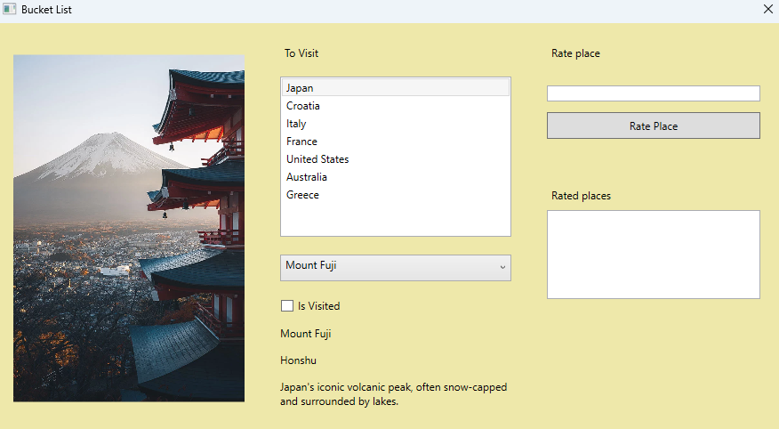
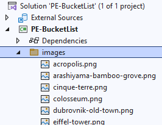
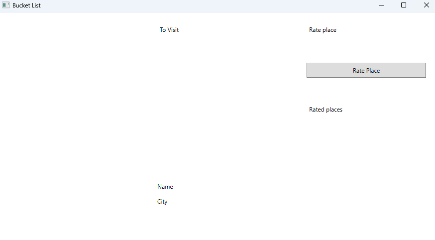
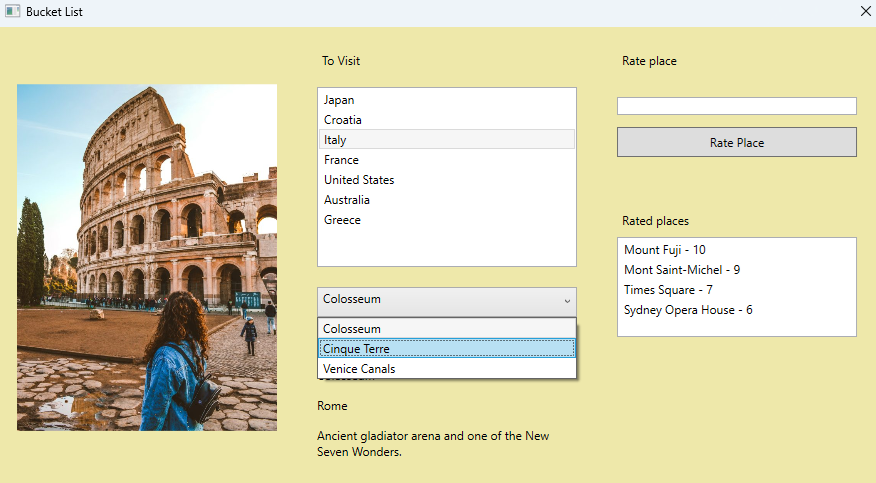
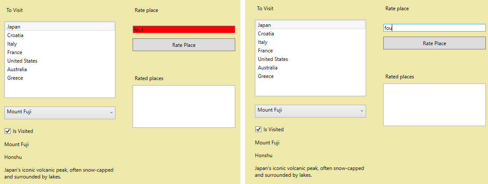
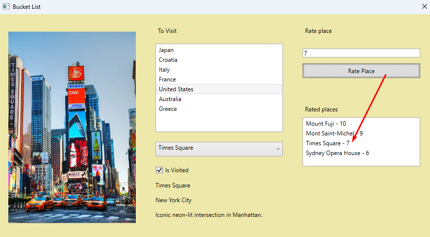

# Bucket List

Het nieuwe jaar, 2026, is bijna daar en voor veel studenten betekent dat ook een nieuwe reeks goede voornemens. Eén van de populairste: meer van de wereld zien.

Gelukkig zijn er vandaag heel wat mogelijkheden om als student buitenlandervaring op te doen. Zo bestaat er bijvoorbeeld DiscoverEU, een Europees programma dat jongeren de kans geeft om met een gratis treinticket door heel Europa te reizen en nieuwe culturen te ontdekken.

Om studenten te helpen hun reisplannen te organiseren, bouw jij in deze opdracht een Bucketlist-app. Met deze applicatie kunnen studenten hun droomlanden bijhouden, bekijken welke plaatsen ze al bezocht hebben, en een rating geven aan een locatie die ze bezocht hebben.

## 1. UI

De designers van DVO hebben alvast uitgetekend hoe het finale resultaat er uit moet zien:

_Figuur 1_

### 1.1. Startbestanden

In dit project heb je al enkele startbestanden zitten, namelijk een folder met de naam “images”. In deze folder zitten alle afbeeldingen van de bestemmingen van je bucket list. Zie Figuur 2.

_Figuur 2: images_

### 1.2. Besturingselementen

_Figuur 3: startsituatie_

Een collega van jou heeft al een aanzet gedaan om met de XAML te starten, zie Figuur 3. Er ontbreken echter nog enkele besturingselementen en vereisten. Los de volgende vereisten op:

| Change request ID | Beschrijving |
|----               |--------------|
| UI-1              | Het venster zelf mag **niet groter of kleiner** gemaakt worden. Bovendien heeft het de volgende kleur: **PaleGoldenrod**. |
| UI-2              | Zorg er voor dat aan de linkerkant van het venster een afbeelding getoond wordt met een **marge van 20** en een **breedte van 260 pixels**. |
| UI-3              | Onder het "To Visit" label zou er een ListBox moeten staan die alle "te bezoeken landen" toont. De ListBox heeft een **breedte van 260 pixels** en een **hoogte van 180 pixels**. |
| UI-4              | Onder de ListBox toon je, zoals te zien in Figuur 1, een **dorp down menu** waarin alle toeristische plekken van het geselecteerde land getoond worden. Dit element heeft een **breedte van 260 pixels** en een **hoogte van 30 pixels**. |
| UI-5              | Onder het drop-down-menu komt een selectievakje dat **de tekst "Is Visited"** toont. |
| UI-6              | Zorg er voor dat het tekst-element, genaamd DescriptionTextBlock, de tekst over meerdere regels laat lopen, indien de tekst te lang is. |
| UI-7              | Voeg een tekstveld toe onder het label "Rate place" en een ListBox onder het label "Rated places". |

> [!NOTE]
> Voeg zelf nog namen toe of event handlers waar jij acht dat ze nodig zijn.

## 2. Models

Maak een folder aan in je project `Models`, zodat alle volgende klasses in de `Models` namespace van je project terecht komen.

### 2.1. Country

#### 2.1.1 Eigenschappen

De klasse Country heeft de volgende eigenschappen
	
 - een eigenschap Name.
 - een eigenschap Places: een verzameling van Place objecten.
 
> [!NOTE]
> Leid zelf af welke datatypes er gebruikt worden in de klasse op basis van de methode `CreateBucketList()`.

#### 2.1.2 Methodes

De klasse Country heeft slechts één methode.

 - een nieuwe implementatie voor de ToString() methode: de methode retrouneert de waarde van Name.

### 2.2 Place

#### 2.2.1 Eigenschappen

 - een eigenschap Name.
 - een eigenschap City.
 - een eigenschap Description.
 - een eigenschap IsVisited.
 - een eigenschap ImageSource.
 
> [!NOTE]
> Leid zelf af welke datatypes er gebruikt worden in de klasse op basis van de methode `CreateBucketList()`.

#### 2.2.2 Methodes

De klasse Place heeft ook slechts één methode.

 - ook hier voorzie je een nieuwe implementatie voor de ToString() methode: de methode retrouneert opnieuw de waarde van Name.

## 3. Vereisten applicatielogica

### 3.1. Opstarten

Wanneer het venster geladen is roep je de methode `CreateBucketList` en een methode `LoadBucketListInListBox()` die je zelf nog aanmaakt.

Maak een methode `LoadBucketListInListBox()`. Deze methode gebruikt de List `_bucketList` om alle `Country objecten in te laden` in de ListBox onder het "To Visit" tekst-element.

Nadat je alle Country objecten hebt ingeladen in de ListBox, zorg je er voor dat het eerste element in de ListBox geselecteerd is.

### 3.2. SelectionChanged Country-ListBox

Wanneer je een selectie verandert in de ListBox van landen, dan laad je automatisch alle `Place` objecten in in het onderstaande drop-down menu. Maak hiervoor gebruik van een methode: `LoadComboBoxItemsFromCountry(Country selectedCountry)`.

Voorzie een methode, genaamd `LoadComboBoxItemsFromCountry(Country selectedCountry)`, die je oproept om alle `Place` objecten van de eigenschap `Places` toe te voegen aan het drop-down menu.

Tot slot zorg je er voor dat het eerste `Place` object geselecteerd is nadat alle `Place` objecten zijn toegevoegd aan het drop-down menu.

### 3.3. SelectionChanged Drop-down menu

Wanneer je een selectie verandert in het drop-down menu van Places, dan laat je automatisch alle informatie zien in de onderstaande tekst-elementen. Maak hiervoor gebruik van een methode: `LoadPlace(Place place)`.

Voorzie een methode, genaamd `LoadPlace(Place place)`, die je oproept om de volgende eigenschappen toe te wijzen aan de daarbijhorende tekst-elementen: `Name`, `City` en `Description`.

Verder vink je het selectievakje aan of uit afhankelijk van de waarde in de `IsVisited` eigenschap.

Tot slot zorg je er voor dat de afbeelding van de plek getoond wordt in het Image element op basis van de `ImageSource` eigenschap van het `Place` object.

### 3.4. Selectievakje aan- of uitvinken

Zorg er voor dat wanneer de gebruiker het selectievakje aan- of uitvinkt automatisch de eigenschap `IsVisited` van het geselecteerde `Place` object in het drop-down menu wordt aangepast naar `true` (aangevinkt) of `false` (uitgevinkt).

> [!NOTE]
> **Let op:** zorg er voor dat je applicatie deze waarde kan blijven onthouden. Je applicatie moet weten welke plaatsen bezocht zijn en welke niet.

### 3.5. Rate een plek

Eens je een plek bezocht hebt, dan kan je er een rating aan toekennen. Gebruik een Dictionary, genaamd `_placeRatings`, die een rating kan opslaan voor elke plek. Elke plek mag slechts één keer voorkomen in je Dictionary. Wanneer een nieuwe rating wordt toegekend aan een bestaande plek, dan overschrijf je de vorige score.

Voordat je een rating aanmaakt voor een `Place` controleer je de volgende voorwaardes:

- Of het tekstveld (dat je reeds zelf hebt toegevoegd) onder het label "Rate place" ingevuld is met een geheel getal.
- Of het ingegeven getal een waarde heeft van nul tot en met tien.
- Of het geselecteerde `Place`-object een waarde `true` heeft voor de `IsVisited` eigenschap.

Indien één van deze voorwaarde faalt, dan verander je de achtergrond kleur van je tekstveld naar rood en maak je geen rating aan.

Indien alle voorwaarde voldaan zijn, dan maak je een rating aan en verander je de achtergrond kleur van je tekstveld terug naar wit. Bovendien voeg je je rating ook toe aan de ListBox onder het label "Rated places". 

Alle ratings die worden getoond in de RatingListBox hebben het formaat: "plekNaam - rating".		

### 3.6. TextChanged

Wanneer er een aanpassing wordt gemaakt door de gebruiker, dan moet de achtergrond kleur van het tekstveld onder het "Rate place" label wit worden.

### 3.7. Sorteer ratings (Extra)

_Deze requirement is een bonus punt. Je moet deze niet vervullen om het maximaal aantal van de punten te scoren._

Zorg er voor dat al je ratings die je toevoegd in de ListBox gesorteerd zijn op basis van hun rating: van hoog naar laag.

